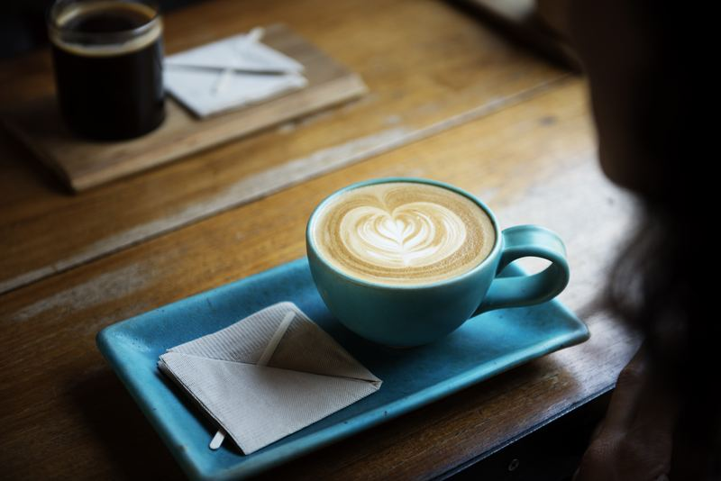
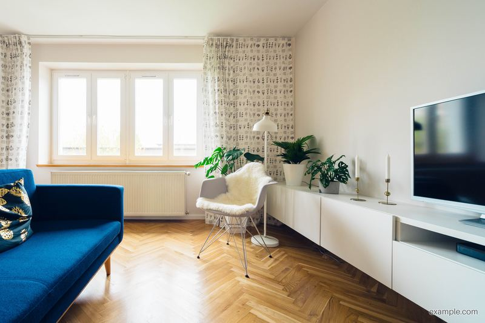
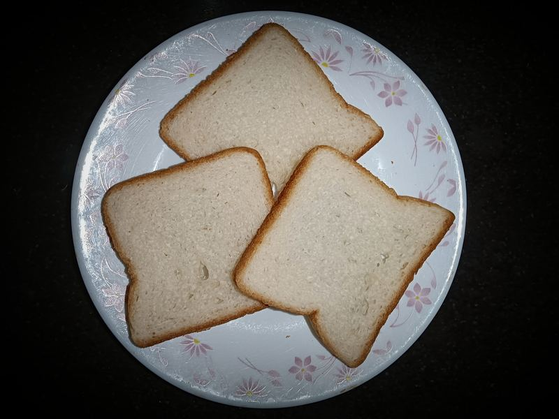
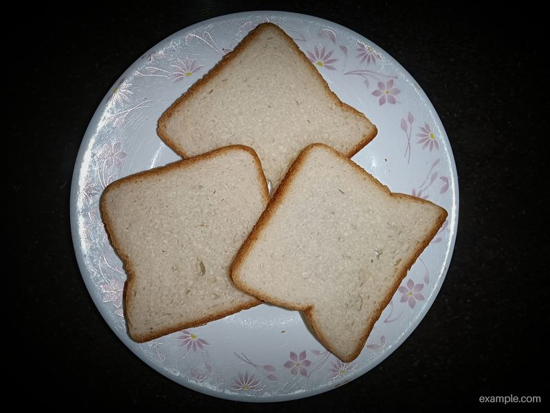
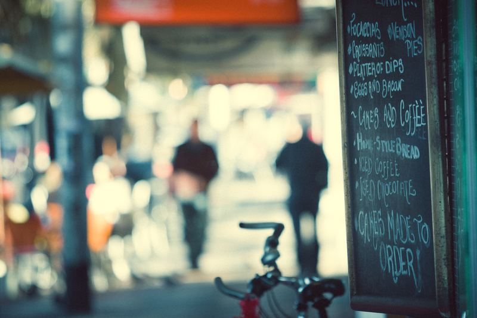
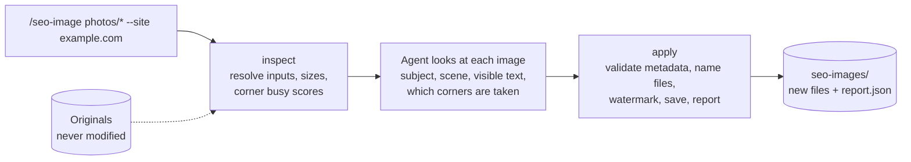

# seo-image

> An AI coding-agent skill that gets images ready for your website: a descriptive filename, alt text,
> title, description and tags written from what is **actually visible**, plus an optional subtle
> domain watermark. Your originals are never touched.

## Examples

Real photos (public domain, see [credits](docs/examples/CREDITS.md)) run through the skill with
`--site example.com`. The text below each pair is copied from the skill's own `report.json`; the
full-quality files are in [`docs/examples/`](docs/examples/).

<!-- examples:start -->

#### a) Product shot

| Before | After |
|:---:|:---:|
|  |  |
| `IMG_4821.jpg` | `latte-art-teal-cup-tray.jpg` |

- **Alt:** Latte with heart-shaped foam art in a teal cup on a teal tray with a folded napkin, on a wooden table
- **Title:** Latte art in a teal cup
- **Description:** A latte with a heart-shaped pattern in the foam sits in a teal cup on a matching tray with a folded paper napkin. A dark drink in a glass is out of focus at the upper left of the wooden table.
- **Tags:** latte, coffee cup, latte art, teal, wooden table
- **Watermark:** applied, bottom-right (example.com)
- **Size:** 6000 × 4004 px, unchanged

#### b) Room interior

| Before | After |
|:---:|:---:|
|  |  |
| `DSC_0412.jpg` | `bright-living-room-blue-sofa.jpg` |

- **Alt:** Bright living room with a blue sofa, a white chair, houseplants and a TV on a low white cabinet
- **Title:** Bright living room with blue sofa
- **Description:** A bright living room with a blue sofa, a white chair with a fluffy white throw and a floor lamp beside a large window. Houseplants and two candles sit on a low white cabinet next to a TV, above a wooden floor.
- **Tags:** living room, interior, blue sofa, houseplants, window
- **Watermark:** applied, bottom-right (example.com)
- **Size:** 5346 × 3568 px, unchanged

#### c) Food

| Before | After |
|:---:|:---:|
|  |  |
| `IMG_7305.jpg` | `three-bread-slices-on-plate.jpg` |

- **Alt:** Three slices of white bread on a round plate with a pink floral pattern, seen from above
- **Title:** Three slices of white bread
- **Description:** Three slices of white sandwich bread with golden crusts lie on a round plate decorated with pink flowers. The plate sits on a dark surface and is photographed from directly above.
- **Tags:** bread, white bread, plate, food
- **Watermark:** applied, bottom-right (example.com)
- **Size:** 4096 × 3072 px, unchanged

#### d) Busy corner

| Before | After |
|:---:|:---:|
|  |  |
| `IMG_2290.jpg` | `chalkboard-menu-cakes-coffee-bread.jpg` |

- **Alt:** Chalkboard menu listing cakes, coffee and bread, with a bicycle handlebar in front of a blurred background
- **Title:** Chalkboard menu with cakes and coffee
- **Description:** A handwritten chalkboard menu lists dishes such as croissants, eggs and bacon, cakes and coffee, and home-style bread. A bicycle handlebar sits in front of a softly blurred background.
- **Tags:** chalkboard, menu, cakes, coffee, bicycle
- **Watermark:** applied, bottom-left (example.com)
- **Size:** 3504 × 2336 px, unchanged

The bottom-right corner (and the top-right) holds the chalkboard's handwriting, so the watermark moved to the quietest free corner: **bottom-left**.

<!-- examples:end -->

## What you get

| For every image | |
|---|---|
| **Filename** | lowercase, hyphenated, at most 5 words / 60 characters, original extension kept, no camera names, never the domain |
| **Alt text** | under 125 characters, natural, never starts with "image of", no keyword stuffing |
| **Title** and **description** | a short media-library title and 1–2 sentences of real context |
| **Tags** | 3–8 relevant, non-redundant tags (fewer when the image has less to say) |
| **Watermark** | only when you give a domain: small, semi-transparent, readable, away from faces and text |
| **Report** | a Markdown table in chat and `report.json` in the output folder |

## How it works

The agent looks at the images; a small, deterministic Python helper does everything mechanical.



- **Visual evidence first.** Metadata describes only what is visible or what you supplied. No
  invented brands, places, models, materials, prices, names or identities, and people are never
  identified.
- **Deterministic where it can be.** Naming, validation, watermarking, saving and reporting are plain
  code with automated tests; understanding the image is the agent's own vision.
- **Generic.** No website, brand or content category is built in. A domain only ever comes from
  `--site` or your config.

## Install

The skill is the folder `.claude/skills/seo-image/`. Copy it into any project's `.claude/skills/`
(or into `~/.claude/skills/`). It needs Python 3.10+ and Pillow (`pip install pillow`).

## Use

```text
/seo-image <image(s) or glob> [--site <domain>] [--context "<page topic>"] [--out <folder>]
```

Examples: `/seo-image hero.jpg`, `/seo-image ./images/* --site example.com`,
`/seo-image a.png b.png --context "kitchen renovation guide"`.

You get a Markdown table in chat and `report.json` in the output folder (default `seo-images/`):
original and new filename, alt, title, description, tags, domain, watermark status and position.

- Filenames: lowercase, hyphenated, at most 5 words and 60 characters, original extension kept,
  never containing the domain.
- No domain means no watermark. A domain is never invented.
- Supported inputs: JPEG, PNG, WebP. Other files (and animated images) are skipped and reported.
- Outputs are saved upright, with GPS data removed and the colour profile kept. Files that need no
  change are copied byte for byte (and keep all their metadata); a re-encoded file keeps its ICC
  profile and EXIF but not XMP or IPTC fields such as creator or copyright. Metadata is reported only; it is not written into the files.
- Rerunning replaces same-named outputs in the output folder; originals are never touched.

## Config

Optional `seo-image.config.json` in the project root (example:
`.claude/skills/seo-image/seo-image.config.example.json`):

```json
{"domain": "example.com", "output_dir": "seo-images",
 "watermark": {"enabled": true, "position": "bottom-right", "opacity": 0.6, "size": 2.5}}
```

Command-line flags (`--site`, `--out`) override the config; the config overrides the defaults.

## Tests

```bash
pip install pillow pytest jsonschema
pytest                       # unit and integration tests (195)
python tests/semantic/check_report.py seo-images/report.json   # after running on the fixtures
```

Semantic quality (is the metadata faithful to the image?) is checked against reviewed fixtures;
see `tests/semantic/README.md`.

## Design

Specification, plan and tasks are in `specs/001-seo-image-skill/`; the principles are in
`.specify/memory/constitution.md`.

## Rebuild the example pictures

The README pictures and text come from the real run in `docs/examples/`:
`python docs/build_readme_examples.py`.
